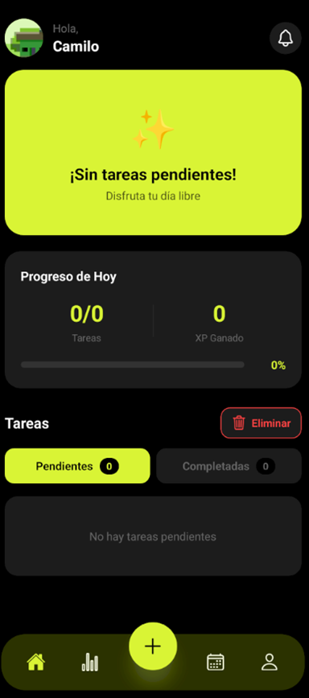
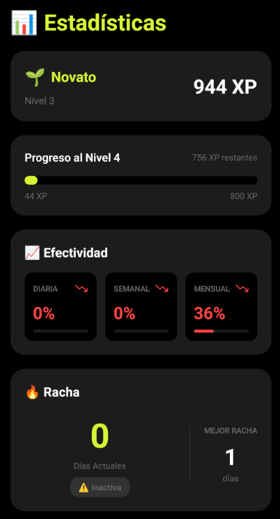
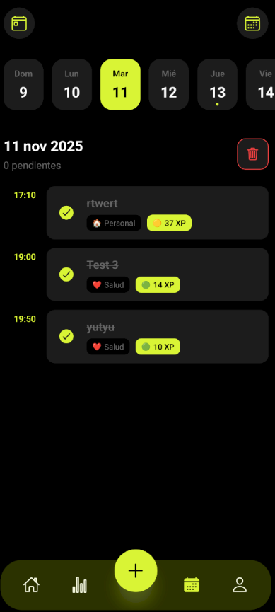
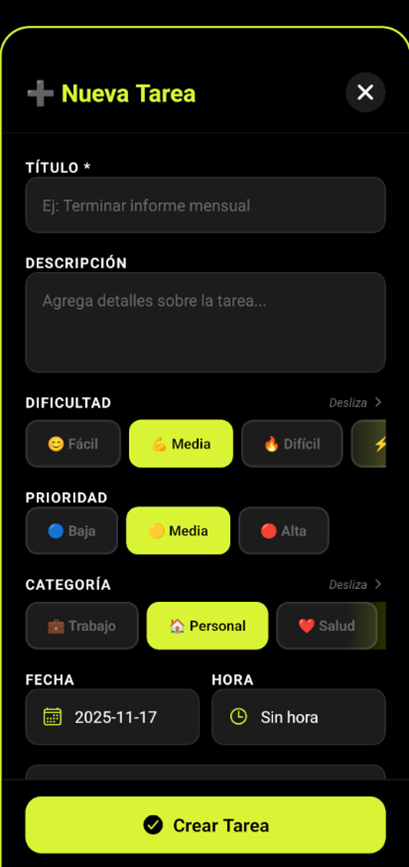

# TaskWise 2.0

A modern task management application built with React Native, Expo, and TypeScript. Features local data persistence with SQLite, push notifications, and an intuitive user interface.

<div align="center">
  
  
  
  
</div>

## 📱 Features

- **Task Management**: Create, edit, delete, and organize your tasks efficiently
- **Push Notifications**: Never miss a deadline with customizable task reminders
- **Local Storage**: All data stored locally using SQLite for offline access
- **State Management**: Powered by Zustand for predictable state management
- **Dark Mode**: Beautiful dark theme optimized for reduced eye strain
- **TypeScript**: Full type safety throughout the application
- **Image Support**: Attach and manage images for your tasks

## 🚀 Tech Stack

- **Framework**: [React Native](https://reactnative.dev/) with [Expo](https://expo.dev/)
- **Language**: [TypeScript](https://www.typescriptlang.org/)
- **Database**: SQLite (expo-sqlite)
- **State Management**: [Zustand](https://github.com/pmndrs/zustand)
- **Navigation**: Expo Router
- **Styling**: NativeWind (TailwindCSS for React Native)
- **Notifications**: Expo Notifications

## 📋 Prerequisites

Before you begin, ensure you have the following installed:

- Node.js (v18 or higher)
- npm or yarn
- Expo CLI (`npm install -g expo-cli`)
- Expo Go app on your mobile device (for testing)
- Android Studio or Xcode (for emulator testing)

## 🛠️ Installation

1. **Clone the repository**
```bash
   git clone https://github.com/yourusername/taskwise-2.0.git
   cd taskwise-2.0
```

2. **Install dependencies**
```bash
   npm install
   # or
   yarn install
```

3. **Set up environment variables** (if needed)
```bash
   cp .env.example .env
   # Edit .env with your configuration
```

## 🏃‍♂️ Running the Application

### Development Mode

Start the development server:
```bash
npx expo start
```

This will open the Expo DevTools in your browser. You can then:

- Press `a` to open in Android emulator
- Press `i` to open in iOS simulator
- Scan the QR code with Expo Go app on your phone

### Development Build

For a development build with custom native code:
```bash
# For Android
npx expo run:android

# For iOS
npx expo run:ios
```

### Production Build

To create a production build:
```bash
# Build for Android
eas build --platform android

# Build for iOS
eas build --platform ios

# Build for both platforms
eas build --platform all
```

## 📁 Project Structure
```
taskwise/
├── app/                    # App screens and navigation
│   ├── (tabs)/            # Tab navigation screens
│   └── _layout.tsx        # Root layout with initialization
├── assets/                # Static assets
│   └── images/            # Image assets
├── components/            # Reusable UI components
├── constants/             # App constants and configuration
├── context/               # React context providers
├── database/              # SQLite database setup and migrations
│   ├── migrations.ts      # Database initialization
│   ├── migrateUserFields.ts
│   └── migrateNotificationFields.ts
├── hooks/                 # Custom React hooks
├── stores/                # Zustand state stores
│   └── notificationStore.ts
├── types/                 # TypeScript type definitions
├── utils/                 # Utility functions
│   ├── imageUtils.ts      # Image handling utilities
│   └── notificationUtils.ts # Notification configuration
└── global.css            # Global styles (NativeWind)
```

## 🗄️ Database Schema

The app uses SQLite for local data persistence with the following main tables:

- **tasks**: Store task information
- **users**: User preferences and settings
- **notifications**: Notification history and settings

## 🔔 Notification Setup

The app supports local push notifications. To configure:

1. Notifications are automatically initialized on app startup
2. Permission requests are handled in `utils/notificationUtils.ts`
3. Notification handlers are set up in the root `_layout.tsx`

## 🎨 Customization

### Theme Colors

The app uses a dark theme with the following primary colors:
- Background: `#000000` (black)
- Primary: `#d9f434` (lime green)
- Error: `#F44336` (red)

Modify colors in:
- `global.css` for global styles
- Individual component StyleSheets

### Navigation Bar

The app automatically hides the Android navigation bar for an immersive experience.

## 🧪 Testing

Run the test suite:
```bash
# Run all tests
npm test

# Run tests in watch mode
npm test -- --watch

# Run tests with coverage
npm test -- --coverage
```

## 📱 Platform-Specific Notes

### Android
- Minimum SDK: 21
- Target SDK: 34
- Navigation bar is hidden for immersive mode

### iOS
- Minimum iOS version: 13.0
- Supports iPhone and iPad

## 🐛 Debugging

1. **Expo DevTools**: Access via browser when running `expo start`
2. **React Native Debugger**: Use Chrome DevTools or React Native Debugger app
3. **Console Logs**: View in terminal or Expo DevTools
4. **Database Inspection**: Use SQLite browser tools to inspect local database


<div align="center">
  Made with ❤️ using React Native and Expo
</div>